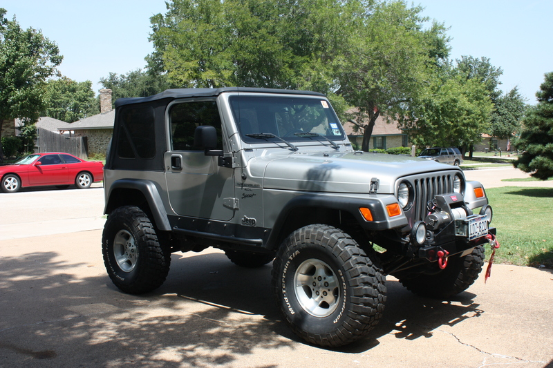

# 2001 Jeep Wrangler TJ Sport  
[JF Thread Link](https://www.jeepforum.com/threads/silver-rubiclone-build.880159/)

4.0l | NV3550 5-spd   
Rubicon Dana 44s, 4.88 factory lockers, chromoly shafts   
Silverstone Metallic  
BFGoodrich 35x12.50x15 on Canyons  
3" BDS Springs  
Pro Comp Shocks  
Rokmen/JKS Adjustable Control Arms  
Currie CurrectLync Steering  
JKS front and rear track bar  
JKS body lift  
JKS 1" MML  
Rokmen tummy tuck   
Rokmen gas tank skid  
No name sliders  
Advanced Adapters SYE  
Coast Custom rear CV shaft  
LoD Front Stubby bumper and winch plate  
Smittybilt rear bumper/tire carrier  
Warn XD9000i  
DIY sway bar quick disconnects  
Teraflex hand throttle  
M.O.R.E. Steering skid  
[Baertrax Buttface Diff Cover](https://www.rockcrawler.com/techreports/baertrax_buttface/index.asp)  
Uniden CB  

Purchased July 2008 @ 68,000mi
Sold 2010

Build thread after sale:  [Catmechanic's TJ6 build](https://www.jeepforum.com/threads/catmechanics-tj6-build.4222450/)  
TJ6, Stretched, LS2 and Atlas II