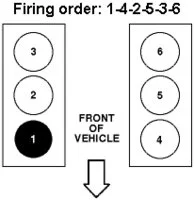

 | [maintenace log](./maintenance) |   

- Engine Type: Twin Turbocharged V6
- Engine Block/Cylinder Head: Aluminum
- Displacement (cc): 3496 | 213 cu-in
- Horsepower: 365 HP @ 5000 rpm
- Torque: 420 ft-lb @ 2500 rpm
- Bore and Stroke (mm): 92.5 x 86.6
- Compression Ratio: 10.0:1
- Valve Train: DOHC 24v
- Fuel Injection: Direct
- Curb Weight	5,789 lbs

## ecoboost firing order 
