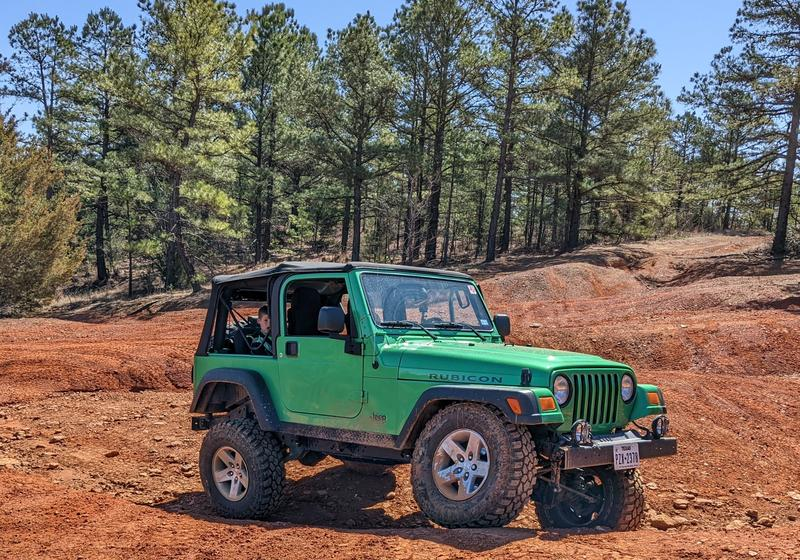

# 2004 Jeep Wrangler TJ Rubicon  
[todo](todo/#todo-list) | [done](todo/#done) | [reference](todo/#reference) | [end goal](end-goal/) | [build thread](../build-thread/)

4.0l | NV3550 5-spd  
Rubicon Dana 44s, facotry 4.10 and lockers  
Electric Lime Green Pearl  
Cooper Evolution M/T 286/75/R16  
3" JKS Springs  
Rancho RS5000x shocks 55239/55256 | [shock math](../build-thread/039)   
Savvy double adjustable aluminum control arms  
Rock Jock front track bar  
JKS rear track bar  
Savvy 1.25" BL  
JKS 1" MML  
UCF extra-clearance steel skid  
Savvy cable shifter  
M.O.R.E. 1" steering riser  
Tom Woods rear CV shaft  
1" StreetRays Seat Risers  
KC Apollo Pro fog lights   
DIY sway bar quick disconnects  
Teraflex hand throttle  
Bulletpoint phone/radio/gopro mount  
Radioddity GM-30 and Baofeng UV-5R  
Wizard Recovery Gear soft shackles  