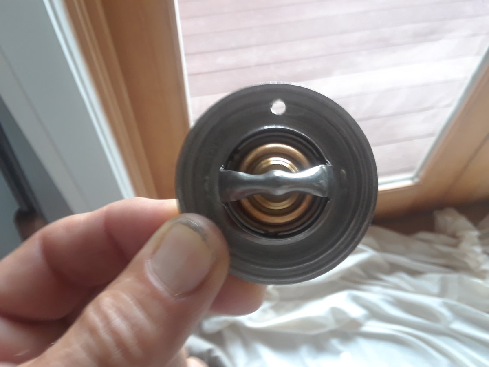
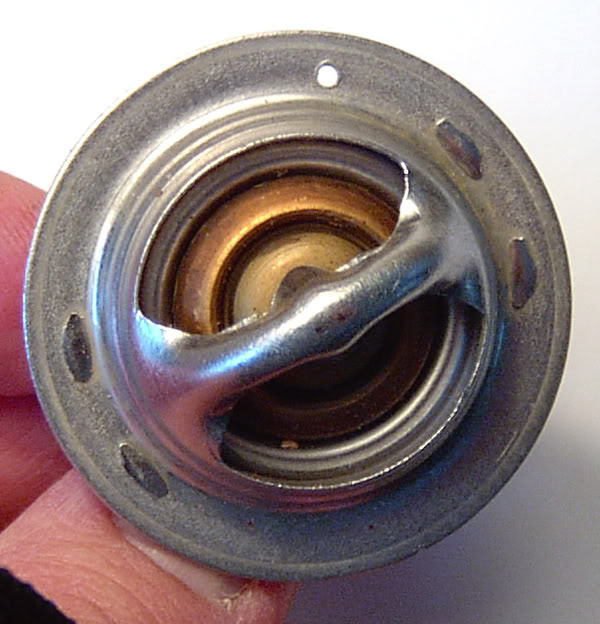

# 2004 Jeep TJ Wrangler Rubicon 
[Build Sheet](https://www.jeep.com/webselfservice/BuildSheetServlet?vin=1J4FA69SX4P757994)

## Todo List 
- oil change at 138,350
- tire rotation at 140,000
- [oil pan and gasket](#oil-pan-and-gasket)
- [rebuild front driveshaft](#rebuild-front-driveshaft)
- [O2 sensors](#o2-sensors)
- [axle ujoints](#axle-ujoints)
- [ball joints](#ball-joints)
- [rms](#rms)
- [timing chain](#timing-chain)
- [unit bearings/hubs](#unit-bearingshubs)
- blend door fixapple
- paint shocks
- paint BL gap
- install front diff lube locker
- service front diff
- [front brakes](#front-brakes)
- [flush brake fluid](#flush-brake-fluid)
- [locker switches wiring](#locker-switches-wiring)
- [adjust steering stops](#steering-stop-adjustment)
- [replace clutch](#clutch)
- skid nutsert replacement
- [front component speakers](#front-component-speakers)
- swayloc
- surface rust in drivers footwell
- [Flip door handles](#flip-door-handles)
- steering pillow
- control arm mini-skids
- [savvy sliders](#sliders)
- hood dent repair?
- [new radio head unit](#stereo-head-unit) 
- [radio separate amp](#radio-amp)
- [separate subwoofer unit?](#subwoofer-unit)
- rear bumper with hitch receiver 
- [winch and winch plate](#winch-stuff)
- half doors
- floor liners
- paint axles?
- [Tailgate Dome Light Activation Switch](#tailgate-dome-light-activation-switch)
- [A/C Defeat](#ac-defeat)
- [new soft top](#new-soft-top)
- [rain cover](#rain-cover)
- currie currect lync
- [241 rear seal](#241-rear-seal-fix)
- [raise gas skid](#raise-gas-skid)
- add a trunk nutserts
- new battery
- battery cables
- morryde tailgate hinges
- factory bumper end caps
- stubby factory front bumper
- rear axle shafts
- front axle shafts
- [regear to 4.88](#regear)
- paint front frame suspension mounts
- new starter
- [aim headlights](#aim-headlights)
- [cooling system](#cooling-system)
- [service johnny joints](#service-johnny-joints)
- [fix blend door](#fix-blend-door)
- [grease front end](#grease-front-end)
- [rear axle seals](#rear-axle-seals)
---

## done
- [repair fog light switch](#repair-mf-switch-fog-lights)
- [h4 headlight conversion](#h4-headlight-conversion)
- [alignment](#alignment)
- [center axle under jeep](#center-axle-under-jeep)
- [set bumpstops](#set-bump-stops)
- [valve cover gasket]()
- [fuse and relay](#fuse-and-relay)
---

## O2 Sensors
NTK was the oem supplier  
[WTJF: The Official Jeep Wrangler TJ Oxygen (O2) Sensor Thread](https://wranglertjforum.com/threads/the-official-jeep-wrangler-tj-oxygen-o2-sensor-thread.4068/)

2004​ 6 cyl  
- NGK #23137 - Bank 1, Sensor 1 (Upstream)​ [Rockauto](https://www.rockauto.com/en/moreinfo.php?pk=1643536&cc=1425901&pt=5132)
- NGK #23135 - Bank 2, Sensor 1 (Upstream)​ [Rockauto](https://www.rockauto.com/en/moreinfo.php?pk=1643382&cc=1425901&pt=5132)
- NGK #23132 - Bank 1, Sensor 2 (Downstream)​ [Rockauto](https://www.rockauto.com/en/moreinfo.php?pk=1643978&cc=1425901&pt=5132)
- NGK #23531 - Bank 2, Sensor 2 (Downstream)​ [Rockauto](https://www.rockauto.com/en/moreinfo.php?pk=1644658&cc=1425901&pt=5132)
  
[O2 Sensor Socket Amazon](https://www.amazon.com/dp/B00GMN4D1Q/?tag=wranglerorg-20)    
[O2 sensor wiring extensions amazon](https://www.amazon.com/dp/B06XKGVFN4/?tag=wranglerorg-20)  

  

## axle ujoints
spicer 5-760x  
[Article: Axle U-Joints & unit bearings](/jeep/axle-ujoints-hubs)  
[WTJF: Jeep Wrangler TJ U-Joint Replacement](https://wranglertjforum.com/threads/jeep-wrangler-tj-u-joint-replacement.8968/)  
[WTJF: Replacing U-Joints: Do You Prefer a Hammer or a Press?](https://wranglertjforum.com/threads/replacing-u-joints-do-you-prefer-a-hammer-or-a-press.14974/page-2)  
[Jeep Wrangler TJ Front Axle U-Joint Replacement Youtube](https://www.youtube.com/watch?v=jh5xM3UFTaU)  
[5-760x pair Amazon](https://www.amazon.com/dp/B014OFD90Y/)  
[Amazon: spicer 5-760x](https://www.amazon.com/dp/B009X1XDZG)  

  

## steering stop adjustment
[4x4xplor steering stop](https://4x4xplor.com/steerstop.html)  

## locker switches wiring
[WTJF: Jeep Wrangler TJ Rubicon Factory Locker Bypass](https://wranglertjforum.com/threads/jeep-wrangler-tj-rubicon-factory-locker-bypass-use-your-lockers-in-4-hi.9241/)  
[wandering trail: locker defeat](https://www.wanderingtrail.com/Mods/TJLJmods/Locker_Defeat.htm)  
[rubicon locker bypass](https://www.rockcrawler.com/2003/04/jeep-rubicon-locker-bypass/)  

## Tailgate Dome Light Activation Switch
[Tailgate Dome Light Activation Switch](https://wranglertjforum.com/threads/tailgate-dome-light-activation-switch.8682/)   

## ac defeat
[JF: For the A/C Guys](https://www.jeepforum.com/threads/for-the-a-c-guys.1058168/)  
[WTFJ: jjvw post](https://wranglertjforum.com/threads/daily-driver-go-where-i-want-to-build.9410/post-145348)  

## winch stuff
[Roundforge: Warn M8000 buyers guide](https://www.roundforge.com/articles/warn-m8000-and-m8-winch/)  
[TRE Thimbles](https://www.tacticalrecoveryequipment.com/product-category/winch-thimble/)  
[TRE Winch Rope](https://www.tacticalrecoveryequipment.com/product-category/synthetic-winch-rope/)  
[TRE Thimble Fairlead](https://www.tacticalrecoveryequipment.com/product-category/winch-fairlead-hawse-fairlead/)  

## new soft top
[Sierra Offroad 2003-2006 TJ Wrangler Soft Top with Tinted Windows, Black Trilogy Acoustic Vinyl](https://www.autotopsdirect.com/product-p/10-40-tj19702-35.htm?1=1&CartID=1)  

## radio amp 
[Crutchfield: Soundstream Picasso Nano PN5](https://www.crutchfield.com/p_530PN5640D/Soundstream-Picasso-Nano-PN5-640D.html)  
[Amazon: Soundstream picasso nano](https://www.amazon.com/dp/B00G051S7I)  
[WTJF: SSTJ build notes](https://wranglertjforum.com/threads/sstjs-mostly-stock-97-se-2-5.50320/#post-980695)  

## clutch 
[HF: Three Jaw Bearing Puller](https://www.harborfreight.com/3-jaw-pilot-bearing-puller-4876.html)   
[Amazon: E12 socket](https://www.amazon.com/dp/B007QV1AZ0)  
[Amazon: Luk clutch kit](https://www.amazon.com/gp/product/B000CICYZ4)   
[Timken 614093 Clutch Release Bearing](https://www.amazon.com/dp/B000BZ6XV4/?tag=wranglerorg-20)  
[National 614093 Clutch Release Bearing Assembly](https://www.amazon.com/dp/B000BZIQ4Q/?tag=wranglerorg-20)  

[WTJF: NV3550 throwout bearing and clutch replacement advice](https://wranglertjforum.com/threads/nv3550-throwout-bearing-and-clutch-replacement-advice.34703/)  
[WTJF: Clutch recommendations and tips?](https://wranglertjforum.com/threads/clutch-recommendations-and-tips.21262/)

This is a bolt-in job, there's not much to it. Just know that there's usually no reason to have to replace the flywheel unless it is physically damaged. Also, don't have the surface of the flywheel resurfaced or refinished. The TJ's flywheel has a domed surface that would be removed if it was resurfaced. At the most, if it has any glazing on its surface, just remove it with a mild grade of sandpaper or emery cloth.

About the only thing not included in that kit that I'd recommend would be a different throwout bearing than what is included. 

## rain cover
[Rain Gear Trail Cover](https://www.raingearcovers.com/product-page/wrangler-tj-1997-2006-trail-cover)  

## rebuild front driveshaft
5-793x - shaft to pinion yoke ujoint  
5-1330x - cv ujoints (2)   
[Denny's driveshaft rebuild kit](https://www.dennysdriveshaft.com/p2297_cv_996_1_rebuild_kit_for_2003_to_2006_jeep_tj_rubicon_with_o.html#photo)  

## flip door handles 
[WTJF: How to Reverse TJ Door Handles](https://wranglertjforum.com/threads/how-to-reverse-tj-door-handles.53652/)  

## repair mf switch fog lights
[WTJF: How to repair multifunction switch for fog lights (fog lights that won't turn off)](https://wranglertjforum.com/threads/how-to-repair-multifunction-switch-for-fog-lights-fog-lights-that-wont-turn-off.3697/)  

## h4 headlight conversion
[WTJF: Cheap Toyota H4 Conversion Kit](https://wranglertjforum.com/threads/toyota-lights-on-your-tj-cheap-quality-led-alternative.52840/)  

## ball joints
[youtube: inner axle seals](https://www.youtube.com/watch?v=JvxKZbQArnQ)  
[WTJF: Wrangler TJ Ball Joint Replacement](https://wranglertjforum.com/threads/wrangler-tj-ball-joint-replacement.281)  
[youtube: jeep ball joint replacement](https://www.youtube.com/watch?v=3ol3TPHzvHk)  
[WTJF: Ball Joint Tool Kit](https://wranglertjforum.com/threads/ball-joint-tool-kit.63711/#post-1155273)  
[Amazon: spicer 706944X ball joint kit](https://www.amazon.com/dp/B007N6OHI0)  

### tools
Press:   
people really like the OTC kits, but they are pricey  
[DHA Ball joint press kit](https://www.amazon.com/dp/B08R2JPLQ7/)   
[OTC 7249 ball joint press](https://www.amazon.com/OTC-7249-U-Joint-Anchor-Service/dp/B0002SRGXY)  
[Amazon OTC Ball Joint kit](https://www.amazon.com/gp/product/B0002SRGXY)  
[HF: Ball Joint Service Kit](https://www.harborfreight.com/ball-joint-service-kit-for-2wd-and-4wd-vehicles-63279.html)  
[orion press kit](https://www.amazon.com/gp/product/B09J54HW7Y)

Adapter kit:
The trick for the ball joints is the 7894 adapter kit (amazon) 
[OTC 7894 ball joint adapter kit](https://www.amazon.com/OTC-Dodge-Joint-Service-Adapter/dp/B0002SRGW0)  
[Amazon OTC Jeep/Dodge Joint service adapter](https://www.amazon.com/gp/product/B0002SRGW0)  
[amazon Sunluway adapter kit](https://www.amazon.com/gp/product/B07FVS1RHJ)

## alignment
[How to align your Jeep Wrangler TJ](https://wranglertjforum.com/threads/how-to-align-your-jeep-wrangler-tj.85/)  

## 241 rear seal fix
[TSB # 21-003-04: Leaking NV241 transfer case on TJ Rubicon models](https://wranglertjforum.com/threads/tsb-21-003-04-leaking-nv241-transfer-case-on-tj-rubicon-models.9314/)  

PARTS  
Retainer, t/case rear (includes rear output shaft seal) 05093606AA (1)  
Washer, t/case rear output shaft sealing 04210973 (1)  
Seal, vehicle speed sensor 05093612AA (1)  
Nut, t/case rear flange 04167924 (1)  
Sleeve, rear flange wear (seal slinger) 05093605AA (1)  
RTV, Engine Sealant 04883971 (1)  
Fluid, transmission/transfer case (ATF+4) 05013457AA (3)  

## sliders
[WTJF: Rock Sliders / Rocker Guards Guide](https://wranglertjforum.com/threads/rock-sliders-rocker-guards-guide.8704/)  

## raise gas skid
[WTJF: What is involved in lifting the gas tank one inch?](https://wranglertjforum.com/threads/what-is-involved-in-lifting-the-gas-tank-one-inch.23059/#post-372896)  
[WTJF: JMT build thread gts clearance mod](https://wranglertjforum.com/threads/05-flame-red-tj-build.3998/page-54#post-322990)  

## front brakes
[front left brake shield](https://www.amazon.com/dp/B074MMV85G)    
[front right brake shield](https://www.amazon.com/dp/B074MM8HTR)    
[BMB: TJ Brakes](https://www.shop.blackmagicbrakes.com/Jeep-TJ-2000-2006_c44.htm)  
[BMB: Front pads and rotors](https://www.shop.blackmagicbrakes.com/Front-Pads-477s-Front-Rotors-67045s-F-BMBP-47700067045.htm)  
[BMB: Front calipers](https://www.shop.blackmagicbrakes.com/Centric-Zinc-Plated-Front-Stock-Replacement-Calipers-No-Pads-58021-58022-NO-PADS.htm)  
[BMB: VANCO 15" Big Brake Kit with Unit Bearings](https://www.shop.blackmagicbrakes.com/VANCO-15-Big-Brake-Kit-w-BMB-Pads-for-15-Rims-w-Unit-Bearings-BBK-NDM15-2UB.htm)  

## unit bearings/hubs
[Article: Axle U-Joints & unit bearings](/jeep/axle-ujoints-hubs)  
[Amazon: Timken bearing hub](https://www.amazon.com/dp/B000BZAF36/)  
[Wrangler TJ wheel hub / bearing assembly replacement](https://www.jeepz.com/forum/drivetrain/42877-wrangler-tj-wheel-hub-bearing-assembly-replacement.html)  
[WTJF: How to Install a Jeep Wrangler Front Axle U-Joint and Hub](https://wranglertjforum.com/threads/how-to-install-a-jeep-wrangler-front-axle-u-joint-and-hub.8967/)  
[WTJF: ElectricWizards 2000 TJ Sport Build](https://wranglertjforum.com/threads/electricwizards-2000-tj-sport-build.14165/post-873537)  
[stuck Unit Bearing - TJ Generation](https://jeepspecs.com/tj-generation/unit-bearing-dislodge/)   
[WTJF: Can't remove front axle, any tips?](https://wranglertjforum.com/threads/cant-remove-front-axle-any-tips.20707/)   

[Stu: unstick that unit bearing](https://web.archive.org/web/20171111184247/http://www.stu-offroad.com/axle/unitbearing/unitbearing-1.htm)

## subwoofer unit
[Amazon: JBL BassPro Nano 6" Powered Subwoofer](https://www.amazon.com/dp/B08J4B1WZH/?tag=wranglerorg-20)  
[Amazon Sound Ordnance B-8PTD 8" Powered Subwoofer](https://www.amazon.com/Sound-Ordnance-B-8PTD-Powered-Subwoofer/dp/B00IF9IIWK)   
[WTJF: SSTJ build notes](https://wranglertjforum.com/threads/sstjs-mostly-stock-97-se-2-5.50320/#post-980695)  
[JF Archive: easy console sub](/jeep/jeep-sub-install)  

## oil pan and gasket
[youtube](https://www.youtube.com/watch?v=Xrj8oIPYSOQ)  

## aim headlights 
[Daniel Stern aim headlights](https://www.danielsternlighting.com/tech/aim/aim.html)  
[WTJF: How to aim and align your headlights](https://wranglertjforum.com/threads/how-to-aim-and-align-your-headlights.2218/)

## flush brake fluid
[WTJF: School me on flushing brake fluid](https://wranglertjforum.com/threads/school-me-on-flushing-brake-fluid.24241/)  
[WTJF: Questions about flushing brake fluid](https://wranglertjforum.com/threads/questions-about-flushing-brake-fluid.18804/)  
[WTJF: Brake Fluid Change](https://wranglertjforum.com/threads/brake-fluid-change.21283/)  
[WTJF: Blaine - Doing a brake job? MUST READ!](https://wranglertjforum.com/threads/doing-a-brake-job-must-read.2247/)  
[How to bleed your brakes](https://wranglertjforum.com/threads/how-to-bleed-your-brakes.528/)

Two quarts of DOT 3/4 is what you need. Start by using a turkey baster to suck the old dirty fluid out of the brake reservoir.

On a system that's never been bled before you may find yourself running 64oz+ through it to get clean fluid. You can do this initial bleed to get clean fluid one person, once it's clean you're going to need a second person to help. If you don't, air can get past the bleeder threads. Don't let the MC run dry.

Don't store open brake fluid, once you open a container it needs to be used.

If you need more than 5-7 bleeds per corner, stop and find the problem because flushing more fluid down the drain isn't going to fix the problem.

Open screw, pedal to the floor hard and fast, close screw, let pedal up, repeat.

## timing chain
[WTJF: Do I need a new timing chain?](https://wranglertjforum.com/threads/do-i-need-a-new-timing-chain.63185/)

## cooling system 

Drilling a hole into the thermostat's flange like shown below and positioning the hole at the top when installing it will help get rid of the trapped air more quickly. Some thermostats come with a vent hole already, just make sure to position it at the top when installing it.

[WTJF: drill hole in thermo](https://wranglertjforum.com/threads/replaced-water-pump-and-thermostat-now-overheating-at-idle.63825/post-1157974)

## battery
AGM battery

[WTJF: AGM Advantages](https://wranglertjforum.com/threads/group-34-vs-group-24-battery-on-2006-tj.57456/post-1011414)

Odyssey
Napa Legend AGM
$220 [Oreilly SuperStart platinum AGM group 34](https://www.oreillyauto.com/detail/c/platinum/super-start-platinum-battery-group-size-34/ssbq/34plt/v/a/17926/automotive-suv-2004-jeep-wrangler?brand=true&pos=9)
- $158 [Oreilly: Super Start Marine AGM Group Size 34M Top Post Battery](https://www.oreillyauto.com/detail/c/marine-agm/super-start-marine-agm-group-size-34m-top-post-battery/ssbj/34magm/v/a/17926/automotive-suv-2004-jeep-wrangler)
- $135 [Sams Duracell AGM Deep Cycle Marine and RV Battery, Group Size 34M](https://www.samsclub.com/p/duracell-agm-deep-cycle-marine-and-rv-battery-group-size-sl34magm/prod3590225)
- $190 [Sams Duracell AGM Automotive 34](https://www.samsclub.com/p/auto-group-24-34agm-36-mo-free/prod9510079?xid=plp_product_1)
- $190 [Sams Duracell AGM Automotive 34/78](https://www.samsclub.com/p/duracell-agm-automotive-battery-group-size-78dtagm/prod3590233?xid=plp_product_3)

duralast platinum agm Auto zone
diehard platinum agm
x2 power 
northstar

"Calcium" AGM like the offerings from NAPA, O'Reillys, Duracell, etc., - good batteries at a more reasonable price point and suitable for most jeepers looking to upgrade from a flooded lead acid battery who either can't afford the price point of a Northstar or don't need the features of a pure lead AGM battery. I will probably buy one of these as my next battery

East Penn vs northstar  
differences between "thick plate calcium AGM batteries" such as the offerings by East Penn, and "thin plate pure lead AGM's" which include Northstar, Odyssey and Optima. The article concludes:

"Both the calcium AGM and the pure lead AGM crank longer and are more tolerant of deep cycle drains than OE maintenance-free batteries. That said, there is a performance difference among these two types of AGM battery. Since the thinner plates in the pure lead AGM have more surface area contact than the thicker plates in the calcium AGM, they are more efficient during both discharging and recharging. The calcium AGM is 'better' while the pure lead AGM is 'best.'"

See: http://www.hendonpub.com/law_and_order/articles/2015/04/agm_battery_technology

It appears from the article that in the hierarchy of AGM's the Napa Legend is better than a flooded lead acid battery but not in the same category as a pure lead AGM battery such as Northstar, Odyssey and Optima. It also explains the substantial price difference between the East Penn offerings and those of the other AGM manufacturers.

Be sure to get a Group 24 instead of a group 34 for the extra capacity.

34 is original
24 is taller, more capacity but lower amps
78 

## center axle under jeep
[WTJF: center axle with adjustable track bar](https://wranglertjforum.com/threads/how-to-align-your-axle-with-an-adjustable-track-bar.16623/#post-270843)  

## set bump stops
[WTFJ: bump walk through with pics](https://wranglertjforum.com/threads/bump-stop-check-walk-thru-with-pics.12883/)  
[WTFJ: How to set your bumpstops](https://wranglertjforum.com/threads/how-to-set-your-bump-stop-on-a-jeep-wrangler-tj.2474/)  

## RMS
[WTFJ: Irun post](https://wranglertjforum.com/threads/a-lesson-learned%E2%80%94keep-it-light-and-nimble.44924/post-849881)  

This is very, very true! Anyone installing a RMS should make sure to use the supplied plastic tab, to ensure the top seal doesn't get knicked. I've learned this one the hard way and had to make a trip to the part store for a second seal kit. Also, care has to be taken to ensure both the upper and lower halves are installed correctly, with the small lip facing forward.

Getting the pan off, with the front Dana 30 or 44 in place, requires unbolting the shocks, dropping the rear as far as it will go, and loosening the exhaust bolts, so the pan will clear.

[WTJF: rms replacement](https://wranglertjforum.com/threads/rear-main-seal-replacement-4-0.826/)  

Tools and Parts Needed
- High Temperature RTV - https://www.amazon.com/dp/B0002UEN1A/?tag=wranglerorg-20
- Oil Pan Gasket - https://www.amazon.com/dp/B000C2AMQ8/?tag=wranglerorg-20
- [Amazon: Rear Main Seal (2000-2006 models)](https://www.amazon.com/gp/product/B000C2E7SM/?tag=wranglerorg-20)
- [Amazon rtv 4318083](https://www.amazon.com/dp/B0002UEONM/?tag=wranglerorg-20) (Anaerobic! Not your average RTVs! It is not cheap but required, ~$16 from dealer. -  No parts stores carry this item.)
- [Amazon: Paint Prepping Solvent](https://www.amazon.com/dp/B0051IC96Y/?tag=wranglerorg-20)
- Sockets and Ratchets with extensions
- Torque Wrench
- 6qts. of Engine Oil
- Oil Filter

[myjeeprocks: rms](https://myjeeprocks.com/articles/rear-main-seal-removal-and-installation/)

Torque specs
bearing race 80 ft/lbs
starter motor 33 ft/lbs
girdle 35 ft/lbs
oil pan bolts 
- 1/4 inch bolts - 84 in/lb
- 5/16 inch bolts - 132 in/lb

## valve cover gasket
[WTJF: changing valve cover gasket](https://wranglertjforum.com/threads/changing-valve-cover-gasket.3431/)  
[WTJF: valve cover gasket replacement](https://www.wranglerforum.com/threads/2003-tj-valve-cover-gasket-replacement.569185/)  
[WTJF: 2000 valve cover gasket](https://www.wranglerforum.com/threads/2000-valve-cover-gasket-replacement.2131161/)  
[WTJF: rtv example](https://wranglertjforum.com/threads/changing-valve-cover-gasket.3431/post-44443)  
I just used RTV on the corners.

The FSM for my 05 stated 10 Newton meters. 

wiring bridge
[WTJF: how to remove plastic wiring bridge](https://wranglertjforum.com/threads/how-to-remove-the-black-plastic-wiring-bridge-on-valve-cover.53776/)  

Page 1019 INSTALLATION
The cylinder head cover is isolated from the cylinder head via grommets and a reusable molded rubber gasket. The grommet and limiter are retained in the cylinder head cover.
1. If a replacement cover is installed, transfer the CCV valve grommet and oil filler cap from the original cover to the replacement cover.
1. Install cylinder head cover and gasket (Fig. 14). Tighten the mounting bolts to 10 N·m (85 in. lbs.) torque.
1. Reinstall the plastic wiring loom trough at the rear of cylinder head cover.
1. Reconnect the left hand side of the wiring harness loom to all components.
1. Connect the CCV hoses.
1. Install control cables and bracket on intake manifold and tighten bolts to 8.7 N·m (77 in lbs.) torque.
1. Connect control cables to throttle body linkage.
1. Snap control cables into cylinder head cover clip.
1. Connect negative cable to battery.

## fix blend door

[WTFJ: blend door](https://marinapoolspaandpatio.com/product-category/robotic-pool-cleaners-maytronics-residential/)   

## grease front end

There are seven total zerks. 2 upper ball joints, the track bar frame end, and 4 in the steering ends.  
[TJ Grease & Lube Fittings - TJ Generation](https://jeepspecs.com/tj-generation/grease-and-lube-fittings/)  

[Grease recommendation | WTJF](https://wranglertjforum.com/threads/grease-recommendation.2161/)  
Lucas Red'n tacky  
[Lucas Oil 3 oz. Red N Tacky (3-Pack) 10318 | Home Depot](https://www.homedepot.com/p/Lucas-Oil-3-oz-Red-N-Tacky-3-Pack-10318/318840010)  
[Lucas Oil 14 oz. Red 'N' Tacky Grease 10005 | Home Depot](https://www.homedepot.com/p/Lucas-Oil-14-oz-Red-N-Tacky-Grease-10005/202521504)

## service johnny joints

I have 18 johnny joints.   
9 2.5" - 8 on the 4 lower cas, 1 on the frame end of the front track bar  
9 2" - 8 on the 4 upper cas, 1 on the diff end of the front track bar  

### grease 
moly grease for RCVs? - johnny joints   
[Red Line Synthetic Grease 80402](https://www.summitracing.com/parts/red-80402)  
[Red Line Synthetic Oil. CV-2 Grease](https://www.redlineoil.com/cv-2-grease)
[CE-9013G - Johnny Joint® Grease](https://www.rockjock4x4.com/CE-9013G)  

tools are $200+, two sizes needed for the uppers and lowers.  
budget option is all thread rod and sockets  

[Johnny Joint Maintenance | Page 4 | WTJF](https://wranglertjforum.com/threads/johnny-joint-maintenance.54875/post-958808)  
@rasband: All thread (or a long bolt), a cup that the housing can rest against, and a socket that is big enough to go around the bolt hole and rest on the washer on the snap ring side. 

[mr blaine: Johnny Joint Maintenance | WTJF](https://wranglertjforum.com/threads/johnny-joint-maintenance.54875/post-957708)   
Two things are key. First, the socket you use to push in the washer to take the load off the snap ring needs to be larger than the hole in the washer by enough not to tilt into the hole. It also needs to be smaller than the amount of room that it takes to pop the snap ring out of the groove. **You can grind a flat on one side to give the snap ring eyes room to pop out.**  

The second thing is when you using all thread to squeeze the washer, **the opposite side needs to be on the body, not the other washer**. Otherwise, you can move the wrong washer or really have to squeeze the races towards each other in hopes that the one under the snap ring moves. React against the body opposite the snap ring and it all works much better.  

### Tools: 
- Vise 
- Big snap ring pliers 
   
rockjock:  
[CE-9110T - 2 1/2” Johnny Joint® Assembly/Disassembly Tool](https://www.rockjock4x4.com/CE-9110T)  
[CE-9112T - 2” Johnny Joint® Assembly/Disassembly Tool](https://www.rockjock4x4.com/CE-9112T)  

ebay:    
[CE-9110T - 2 ½” Johnny Joint® Assembly/Disassembly Tool  | eBay](https://www.ebay.com/itm/324585499103)  
[CE-9112T - 2” Johnny Joint® Assembly/Disassembly Tool  | eBay](https://www.ebay.com/itm/324585530236)  

  

### bolts  
check for drilled balls when disassembled. if balls are drilled, it can accept grease from drilled bolts.  
greaseable bolts for johnny joints  
[CE-91107 - 9/16" Greaseable Bolts for Currie Johnny Joint - Savvy Off Road](https://savvyoffroad.com/product/ce-91107/)  
[rock jock Greasable Bolts](https://www.rockjock4x4.com/products/johnny-joints-rod-ends/johnny-joints-parts-department/johnny-joints-greasable-bolts)  

### how to guides
[How-To Rebuild a Johnny Joint - YouTube](https://www.youtube.com/watch?v=hUGd6_FYho8)
[How To Rebuild Johnny Joint, With or Without the Expensive Rebuild Tool! - YouTube](https://www.youtube.com/watch?v=xABN89PIDZE)
[Rebuilt | Currie Johnny Joint - YouTube](https://www.youtube.com/watch?v=5LfOErncvQU)

track bar grease fittings are 1/4-28 threaded  
[Precision 1/4-28 Inch flush Grease Zerk 621 | O'Reilly](https://www.oreillyauto.com/detail/c/precision/hardware---fasteners/brass-fittings/grease-fittings/49e6d129c331/precision-1-4-28-inch-grease-zerk/opj0/621)  
[1/4-28 Flush Straight Grease Zerk Fitting 5 Pcs](https://zerksplus.com/1-4-28-flush-straight-grease-zerk-fitting-5-pcs/)  
[Metal Grease Fitting Plugs | Huyett](https://www.huyett.com/products/grease-fittings-lubrication/fittings/grease-plugs?fs_threadsize=1%2F4%22)

## front component speakers

[KICKER | KS Series 5.25" Components KSS504 or KSS50](https://www.kicker.com/47KSS50)  
[Kicker 47KSS504 KS Series 5-1/4" component speaker Crutchfield](https://www.crutchfield.com/p_20647KSS50/Kicker-47KSS504.html)

## stereo head unit

[Clarion M508 Marine | Crutchfield](https://www.crutchfield.com/p_020M508/Clarion-M508.html)  
[Kenwood Excelon KMM-X704 | Crutchfield](https://www.crutchfield.com/p_113KMX704/Kenwood-Excelon-KMM-X704.html)  

## regear

[Grimm Jeeper Gear Ratio Calculator](http://www.grimmjeeper.com/gears.html)  
thinking 4.88s for my nv3550 and 33s  
this is what i had in my '01 with 35s and it was fine.  
[Nitro Gear set](https://www.nitro-gear.com/Rubicon-Dana-44-Front-and-Rear-Nitro-Gear-Package-p/gptjrubicon-xxx.htm)

## rear axle seals
9912S  
[Leaky rear axle seal, what'd I mess up? | Jeep Wrangler TJ Forum](https://wranglertjforum.com/threads/leaky-rear-axle-seal-whatd-i-mess-up.64522/post-1175398)  
Edit: the one on the right is SKF 18731  
[SKF 18731 Grease Seals](https://a.co/d/fyvCeIh)  

## fuse and relay
[Fuse box diagram Jeep Wrangler TJ and relay with assignment and location](https://fuseandrelay.com/jeep/wrangler.html)  